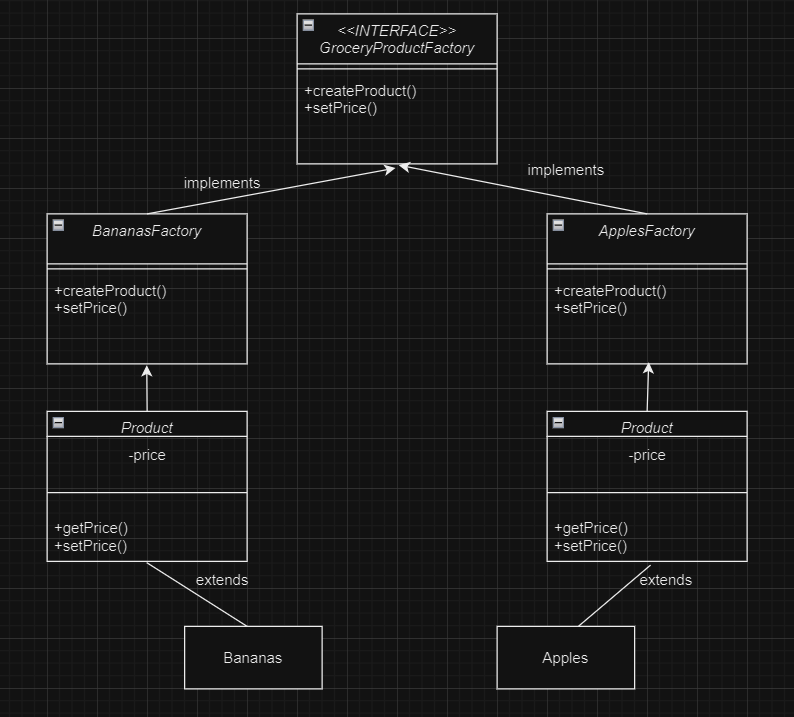
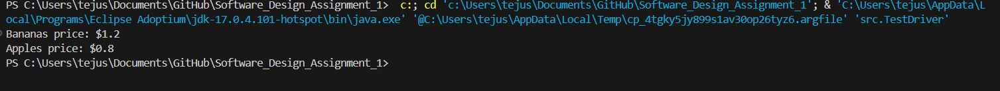

# Software_Design_Assignment_1
Tejush Badal
100816539
September 22, 2024

# Grocery Store Product Factory

This project implements a design pattern assignment using both the **Abstract Factory Pattern** and the **Factory Method Pattern**. The goal is to create different grocery products (such as Bananas and Apples), set their prices after creation by reading from a data file, and demonstrate the functionality with a test driver.

## UML DIAGRAM



## Project Structure

The repository is structured as follows:

### **1. `src/`**
This directory contains the source code for the assignment.

- **`GroceryProductFactory.java`**: 
  - Defines the abstract factory interface that creates products and sets their prices.
  
- **`BananasFactory.java`**:
  - Implements the `GroceryProductFactory` interface to create `Bananas` and set the price based on the data file.
  
- **`ApplesFactory.java`**:
  - Implements the `GroceryProductFactory` interface to create `Apples` and set the price based on the data file.

- **`Product.java`**:
  - Abstract base class for all products, providing the blueprint for setting and getting product prices.

- **`Bananas.java`**:
  - Concrete class that represents the Banana product, extending the `Product` class.

- **`Apples.java`**:
  - Concrete class that represents the Apple product, extending the `Product` class.

- **`TestDriver.java`**:
  - Main test class that demonstrates the functionality of the factory pattern. It creates instances of `Bananas` and `Apples` using the factories and sets the price from the data file.

### **2. `data/`**
This folder contains the product data file.

- **`products.json`**:
  - The json file contains the product names and their respective prices. This is used by the factories to set product prices.

  Example content:
  ```json
  {
      "Bananas": 1.2,
      "Apples": 0.8
  }
### **3. `lib/`**
This folder contains the .jar file dependancy that is needed to parse the dataset into a JSON object 

### **4. `static/`**
This folder contains the output screenshots and UML diagrams for this application

# Test Methods

## TestDriver.java
    - The TestDriver class demonstrates the functionality of the abstract factory and factory method patterns by creating product objects and setting their prices based on data read from the products.txt file.

### Example of the Test Cases:
Creating Bananas and Setting the Price:

    - The program creates a Bananas object using the BananasFactory.
    It reads the price from products.txt and assigns the value to the Bananas object.
    Creating Apples and Setting the Price:

    - Similarly, the program creates an Apples object using the ApplesFactory.
    The price for Apples is retrieved from the products.txt file and assigned.
### Sample Output

